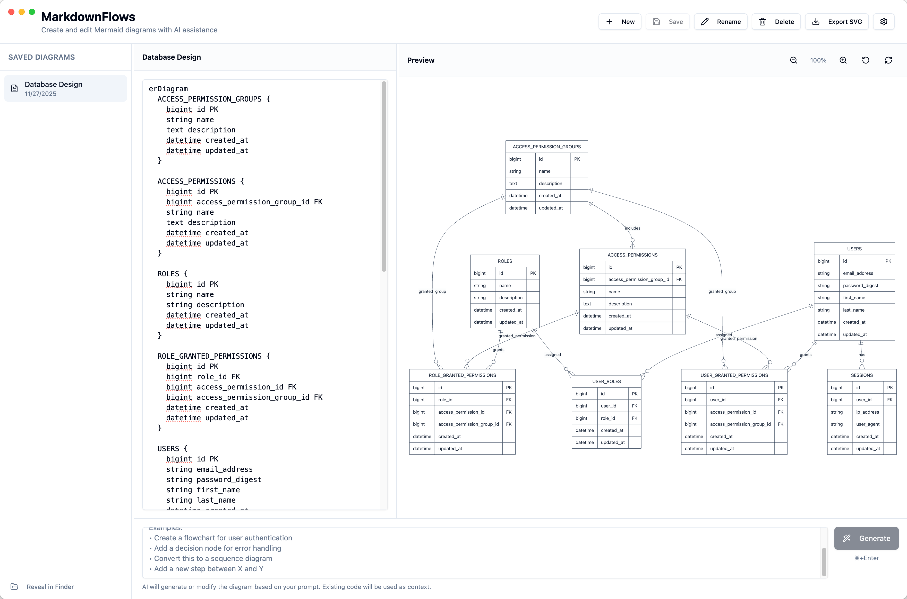

# MarkdownFlows

AI-powered Mermaid diagram editor - Create and edit diagrams with natural language.



## Features

- **📝 Visual Mermaid Editor** - Write and preview Mermaid diagrams in real-time
- **🤖 AI-Powered Generation** - Describe diagrams in natural language and let AI create them
- **💾 Local-First Storage** - All diagrams stored securely on your device
- **🔒 Secure API Keys** - OpenAI keys encrypted using your system's secure storage
- **📤 SVG Export** - Export diagrams as high-quality SVG files
- **🎨 Clean Print-Ready Theme** - Neutral colors optimized for both screen and print

## Supported Diagram Types

- **Flowcharts** - Process flows, decision trees, workflows
- **Sequence Diagrams** - Interactions between participants
- **Class Diagrams** - Object-oriented structures
- **State Diagrams** - State machines and transitions
- **ER Diagrams** - Entity relationships
- **Gantt Charts** - Project timelines
- **Pie Charts** - Data visualization
- **Mind Maps** - Brainstorming and organization

## Getting Started

```bash
# Clone the repository
git clone https://github.com/dotnetfactory/markdownflows.git
cd markdownflows

# Install dependencies
npm install

# Run the app
npm start
```

## Usage

### Creating Diagrams

1. **Manual Editing**: Write Mermaid syntax directly in the editor pane
2. **AI Generation**: Describe what you want in the prompt area and click "Generate"

### AI-Powered Generation

MarkdownFlows uses OpenAI to generate and modify diagrams. You can:

- **Create new diagrams**: "Create a flowchart for user authentication"
- **Modify existing**: "Add error handling to the payment process"
- **Convert types**: "Convert this flowchart to a sequence diagram"
- **Add elements**: "Add a decision node after the validation step"

### Keyboard Shortcuts

| Shortcut | Action |
|----------|--------|
| `⌘/Ctrl + Enter` | Generate diagram from prompt |
| `⌘/Ctrl + S` | Save diagram |
| `⌘/Ctrl + +` | Zoom in |
| `⌘/Ctrl + -` | Zoom out |
| `⌘/Ctrl + 0` | Reset zoom |

## Configuration

### OpenAI API Key

1. Click the Settings icon (⚙️) in the header
2. Enter your OpenAI API key
3. Optionally change the model (default: `gpt-5`)
4. Click "Test Connection" to verify
5. Click "Save Settings"

Your API key is stored securely using your operating system's keychain/credential manager.

## Development

### Prerequisites

- Node.js 18+
- npm 9+

### Project Structure

```
markdownflows/
├── src/
│   ├── main.ts              # Electron main process
│   ├── preload.ts           # IPC bridge
│   ├── renderer.tsx         # React entry point
│   ├── App.tsx              # Root component
│   ├── pages/
│   │   └── DiagramsPage.tsx # Main editor page
│   ├── components/
│   │   └── ui/              # shadcn/ui components
│   ├── services/
│   │   ├── DiagramStorageService.ts
│   │   ├── OpenAIService.ts
│   │   └── SettingsService.ts
│   └── lib/
│       └── utils.ts
├── package.json
├── forge.config.ts
├── tailwind.config.ts
└── tsconfig.json
```

### Scripts

```bash
npm start        # Run the app
npm run lint     # Run ESLint
npm run format   # Format code with Prettier
```

## Tech Stack

- **Electron** - Cross-platform desktop app
- **React 19** - UI framework
- **TypeScript** - Type safety
- **Tailwind CSS** - Styling
- **shadcn/ui** - Component library
- **Mermaid.js** - Diagram rendering
- **OpenAI** - AI diagram generation
- **Vite** - Build tooling

## Contributing

Contributions are welcome! Please feel free to submit a Pull Request.

1. Fork the repository
2. Create your feature branch (`git checkout -b feature/amazing-feature`)
3. Commit your changes (`git commit -m 'Add some amazing feature'`)
4. Push to the branch (`git push origin feature/amazing-feature`)
5. Open a Pull Request

## Author

Created by [Emad Ibrahim](https://www.emadibrahim.com)

## Sponsor

This project is sponsored by **[EliteCoders](https://www.elitecoders.co)** - a complete remote talent solution providing on-demand, high-performance software development teams. EliteCoders connects you with top-tier engineers across 100+ skills, offering flexible engagement models from staff augmentation to dedicated teams and project-based delivery.

[Learn more about EliteCoders →](https://www.elitecoders.co)

## License

MIT License - see the [LICENSE](LICENSE) file for details.

## Acknowledgments

- [Mermaid.js](https://mermaid.js.org/) for the amazing diagram library
- [OpenAI](https://openai.com/) for AI capabilities
- [shadcn/ui](https://ui.shadcn.com/) for beautiful UI components
